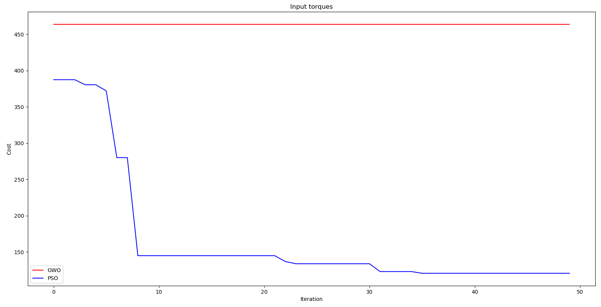

# Controls Project
## Overview
This project aim to test performace of different machine learning algorthims to 
set the value to Kp, Ki, Kd, Q and R values of a hybrid LQR-PID controller

## Results

## Dependencies
- pymunk
- matplotlib
- numpy
- solution
- pyswarms

## Demo
Run demo.py
## Copyright

Copyright (C) 2019 Toyas Dhake, Raghav Agrawal.

For license information, see [LICENSE.txt](LICENSE.txt).

# Contributors

1. Toyas Dhake (Navigator)
- Robotics engineer, University of Maryland College Park.
- Skilled in embedded system with applications involving Arduino, Raspberry Pi 
and Jetson Boards.

2. Raghav Agarwal
- Robotics engineer, University of Maryland College Park.
- Mechanical engineer, University of Maryland College Park.